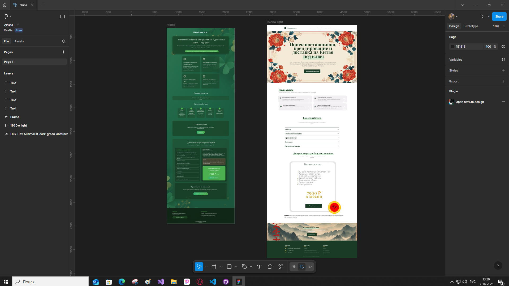

# ChinaOpt - Дизайн для сервиса поставок из Китая  

## 🌿 Концепция дизайна  

Создал современный дизайн для компании, специализирующейся на поставках товаров из Китая. Основной акцент — профессиональный и стильный образ с использованием зеленой цветовой гаммы (как символ удачи и роста бизнеса), но без плоских однотонных заливок.  

### 🔍 Ключевые особенности:  

1. **Сочная зеленая палитра**  
   - Основные оттенки: #2E8B57 (морская зелень), #3CB371 (средний весенний зеленый), #228B22 (лесной зеленый)  
   - Градиенты и полупрозрачные элементы для глубины  
   - Текстуры листьев/клевера в качестве деликатных акцентов  

2. **Структура контента**  
   - Четкое разделение на смысловые блоки  
   - Акцентные карточки услуг  
   - Интерактивные элементы (отзывы, кнопки CTA)  

3. **Фирменный стиль**  
   - Логотип с клевером (4 листа — символ удачи в бизнесе)  
   - Современные шрифтовые пары (например, Rubik + Montserrat)  
   - Пространство и воздушность в композиции  

## 📸 Скриншоты  

[]  

## 🛠 Основные блоки сайта  

### 1. Герой-секция  
- Крупный заголовок с ключевым предложением  
- Подзаголовок с кратким описанием услуг  
- Кнопка призыва к действию  

### 2. Услуги (4 карточки)  
- Иконки + краткое описание каждого направления  
- Анимация при наведении  

### 3. Отзывы клиентов  
- Фото + текст отзыва  
- Слайдер для просмотра  

### 4. Как это работает  
- Пронумерованные шаги сотрудничества  
- Визуализация процесса  

### 5. Доступ в базу поставщиков  
- Список категорий товаров  
- Условия доступа  
- Кнопка оплаты  

### 6. Футер  
- Контакты и реквизиты  
- Юридические документы  

## 🌟 Почему этот дизайн работает?  
- Сочетает профессиональный подход с дружелюбным интерфейсом  
- Зеленый цвет вызывает ассоциации с ростом и надежностью  
- Четкая структура помогает клиентам быстро находить нужную информацию  
- Акценты на ключевых услугах и преимуществах  

Дизайн полностью адаптивен и готов к реализации!
